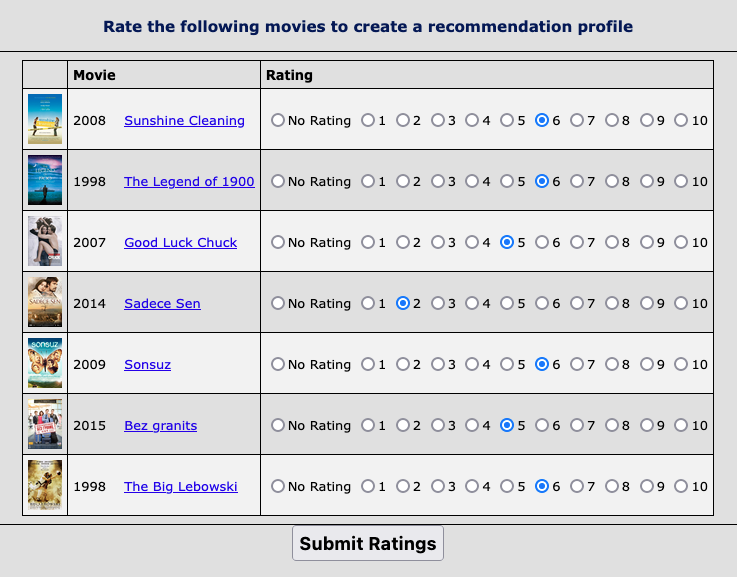
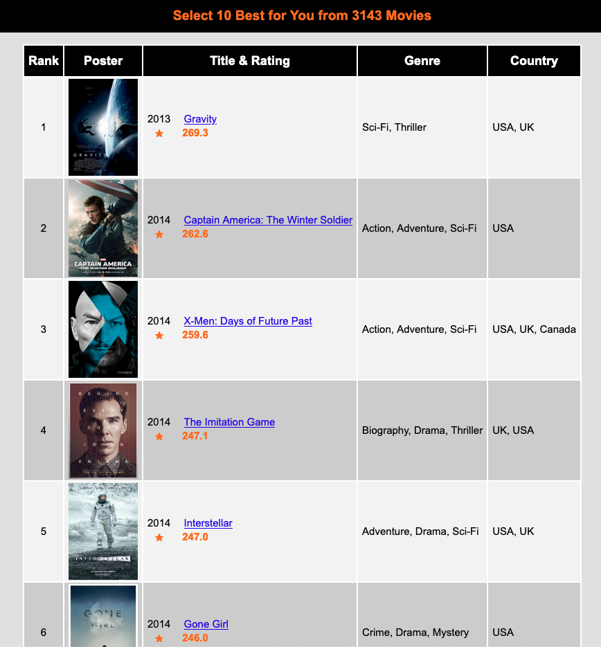

# Java Programming：A DIY Version of Netflix And Amazon Recommendation Engines

## Introduction

This is the final capstone project of Coursera specialisation **[Java Programming and Software Engineering Fundamentals Specialization](https://www.coursera.org/specializations/java-programming)**. You can visit [HERE](https://www.coursera.org/learn/java-programming-recommender?specialization=java-programming) to find out if you want to build one yourself. This project runs a Movie Recommendation System from a data set of 3143 ratings which comes from tweets. Visit [HERE](https://github.com/sidooms/MovieTweetings) if you want to know more about the data. 

When running, first submit some of your preferences to our recommendation engine. The recommendation outcomes will come afterwards.

## Run this project

[Click HERE to start!](https://www.dukelearntoprogram.com//capstone/recommender.php?id=5qCDQvxImdrlJy)

## Example

### Input

### Output

